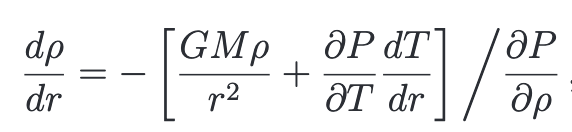
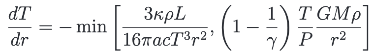
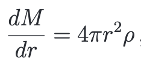
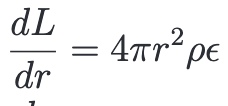
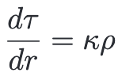
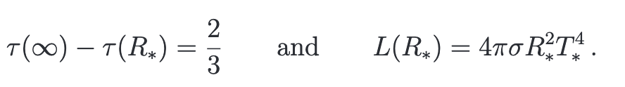
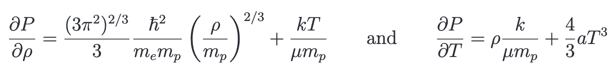

#### Part 1: Solve the Original Equations of Stellar Structure

###### Equations

We have to solve the equations:
* hydrostatic equilibrium (as a function of density)

* the transport equation

* the definition of the enclosed mass

* energy generation equation

* optical depth (added so that we can define the photosphere)

###### Boundary Conditions of Equations

The center boundary conditions are M(0) = 0 and L(O) = 0.

The radius boundary conditions are

###### Partials of Pressure

We can use these to input into the hydrostatic equations!

#### Part 2: Changing the Equations to Helium or Carbon Cores

We need to change the energy generation rates in for burning He or C respectively. We are given the specific energy generation rates for each of those cores. **(Does this correspond to the total energy generation rate, to the e_CNO or to e_PP?)** Therefore our energy generation equation changes, and this generates other stellar structures.

From these stellar structures we need to:
* Explore the main sequences for He and C Cores
* Explore the M-R and L-M relations for He and C Cores
* Estimate the lifetimes of stars for each core
* Estimate which regions of sequences are long lived enough to justify the equilibrium assumptions underlying their construction.
